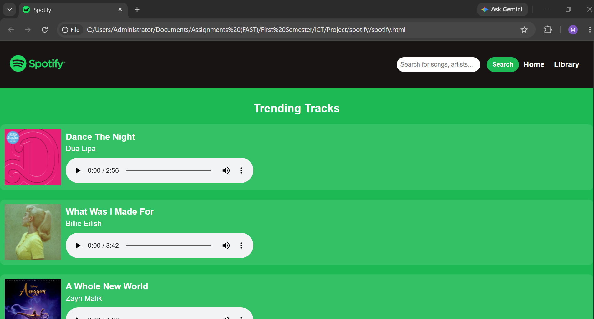
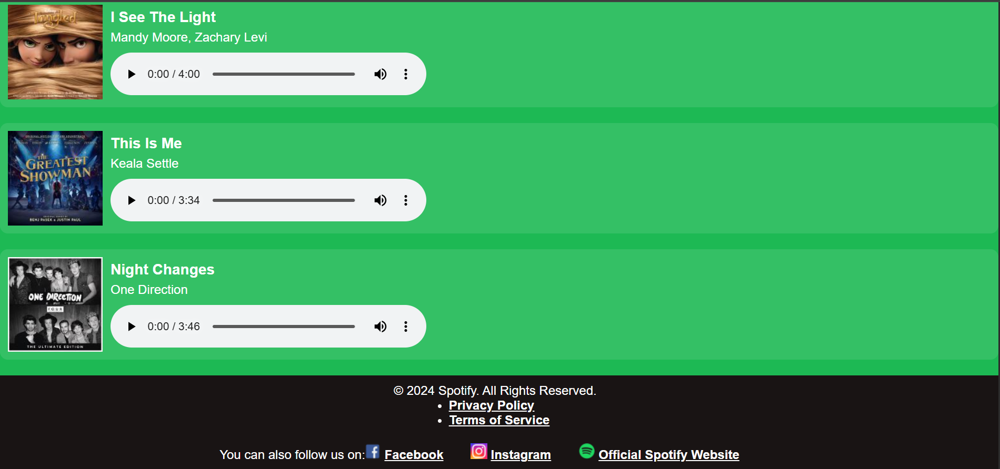

# 🎵 Spotify Clone

## 📖 Overview

The **Spotify Clone** is a front-end web application that recreates the user interface of Spotify using **HTML** and **CSS**. The project features a clean and modern design inspired by the original Spotify platform, allowing users to browse trending tracks, search for music, and play songs using built-in audio controls.

Developed as part of an **Introduction to Information and Communication Technology (ICT) semester project**, this application demonstrates the implementation of modern web design principles, semantic HTML, CSS styling, responsive layouts, multimedia integration, and user-friendly interface design.

---

## ✨ Features

- 🎵 Spotify-inspired user interface
- 🔍 Search bar for music discovery
- 🎧 Audio playback controls
- 📀 Trending tracks section
- 🖼️ Album artwork display
- 📱 Responsive page layout
- 🔗 Navigation menu
- 🌐 Footer with social media links

---

## 🛠️ Technologies Used

- HTML
- CSS
- Visual Studio Code

---

## 📂 Project Structure

```text
Spotify-Clone/
│
├── spotify.html
├── style.css
├── logo.png
├── track images/
├── audio files/
├── README.md
└── screenshots/
```

---

## 🚀 Getting Started

### Clone the repository

```bash
git clone https://github.com/your-username/Spotify-Clone.git
```

### Open the Project

Open the project folder in **Visual Studio Code** or any code editor.

### Run the Application

Simply open **spotify.html** in your preferred web browser.

No additional installation or dependencies are required.

---

## 📸 Preview




---

## 📋 Project Highlights

- Clean Spotify-inspired interface
- Interactive music player using HTML5 Audio
- Organized playlist layout
- Styled using modern CSS techniques
- Beginner-friendly front-end project

---

## 🎯 Learning Outcomes

This project demonstrates:

- Semantic HTML5
- CSS3 Styling
- Responsive Web Design
- Multimedia Integration
- Web Page Layout Design
- Navigation Design
- UI/UX Fundamentals

---

## 🔮 Future Improvements

- JavaScript functionality
- Dynamic search feature
- Music playlist management
- User authentication
- Dark/Light mode
- Responsive mobile navigation
- Backend integration
- Real-time music streaming

---

## 👩‍💻 Contributor

**Manaal Amir**

---

## 📄 License

This project was developed for educational purposes as part of an Information and Communication Technology (ICT) semester project and is intended for learning and academic use.

> **Disclaimer:** This project is a non-commercial educational clone inspired by Spotify. Spotify's trademarks, branding, and media assets belong to their respective owners.
